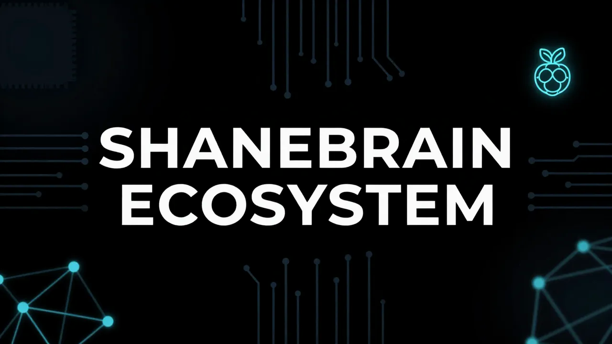

# thebardchat.github.io

Public landing page and ecosystem hub for the **ShaneBrain** project — a personal AI legacy system by Shane Brazelton.

> "If you don't own your infrastructure, you don't own your future."

This project operates under the [ShaneTheBrain Constitution](https://github.com/thebardchat/constitution/blob/main/CONSTITUTION.md).

---

## What This Site Does

The GitHub Pages site at [thebardchat.github.io](https://thebardchat.github.io) serves as the central directory for the ShaneBrain ecosystem, linking to active projects including:

- **shanebrain-core** — Discord bot with RAG, Weaviate, and social automation
- **angel-cloud** — Gateway with user registration and angel progression
- **pulsar_sentinel** — Post-quantum cryptography security
- **SB-Management-OS** — Operations hub
- **loudon-desarro** — Athletic complex visualization
- **BGKPJR-Core-Simulations** — Electromagnetic launch architecture

---

## Infrastructure

All `thebardchat` repositories run on local-first hardware:

| Component | Detail |
|-----------|--------|
| **Compute** | Raspberry Pi 5 (16 GB RAM) |
| **Chassis** | Pironman 5-MAX by Sunfounder (NVMe RAID) |
| **Storage** | 2x WD Blue SN5000 2 TB NVMe — RAID 1 via mdadm |
| **Core path** | `/mnt/shanebrain-raid/shanebrain-core/` |
| **Local AI** | Ollama (llama3.2:1b default) |
| **Vector memory** | Weaviate (Docker, 8080/50051) |
| **Networking** | Tailscale VPN across all nodes |

> Pi before cloud. Privacy before convenience. — Pillar 4

---

## Credits

Built with Claude (Anthropic) · Runs on Raspberry Pi 5 + Pironman 5-MAX

| Partner | Role |
|---------|------|
| **Claude by Anthropic** · [claude.ai](https://claude.ai) | Co-built this entire ecosystem |
| **Raspberry Pi 5** · [raspberrypi.com](https://www.raspberrypi.com) | Local compute backbone |
| **Pironman 5-MAX** · [pironman.com](https://www.pironman.com) | NVMe RAID 1 chassis that made it real |

---

*[@thebardchat](https://github.com/thebardchat) · Hazel Green, Alabama*

---

## Support This Work

If what I'm building matters to you — local AI for real people, tools for the left-behind — here's how to help:

- **[Sponsor me on GitHub](https://github.com/sponsors/thebardchat)**
- **[Buy the book](https://www.amazon.com/Probably-Think-This-Book-About/dp/B0GT25R5FD)** — *You Probably Think This Book Is About You*
- **Star the repos** — visibility matters for projects like this

Built by **Shane Brazelton** · Co-built with **Claude** (Anthropic) · Hazel Green, Alabama

---

*Part of the [ShaneBrain Ecosystem](https://github.com/thebardchat) · Built under the [Constitution](https://github.com/thebardchat/constitution)*

